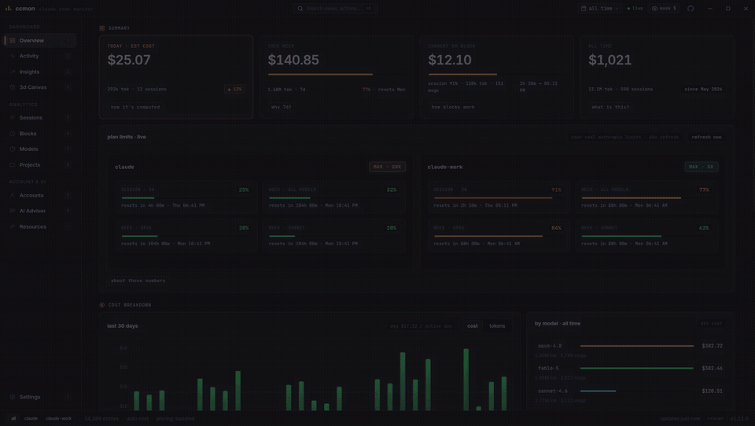

<h1 align="center">ccmon</h1>

<p align="center"><b>A live dashboard for everything Claude Code does on your machine.</b></p>

<p align="center">
  <a href="https://github.com/iskandarputra/ccmon/actions/workflows/ci.yml"></a>
  <a href="LICENSE"></a>
  
  
  
  
</p>

<p align="center">
  
</p>

<p align="center"><i>A scripted tour across a synthetic multi-account dataset, recorded with <code>npm run promo</code>.</i></p>

Claude Code already writes every response it gives you, with exact token
counts, to local transcript files. ccmon watches those files and turns them
into numbers you can actually read. What today cost. How hot your 5-hour
window is running. Which model is eating the budget. When your limits reset.

No API key. No setup. No telemetry.

## Start

```bash
npm install
npm run dev
```

That's it. ccmon finds `~/.claude` on its own, indexes your history in a few
seconds, then follows along. New responses appear within a second.

## What it knows

**Your real limits, live.** ccmon reads the same numbers the `/usage` screen
in Claude Code reads. Then it learns your pace and tells you when you'll hit
the cap. "Caps around Friday 1am at this pace" is more useful than a
percentage.

**Every account, side by side.** Got more than one Claude Code login? ccmon
shows each account's identity, plan, and live limits at once. When one is
about to cap while another sits idle, it tells you, and hands you the exact
`claude-cross-resume` command to pick up where you left off on the account
that still has room. There's a setup wizard that writes the per-shell
`claude-*` wrappers for you.

**The current 5-hour block.** Burn rate, countdown, and a projection of
where the block lands. Plus 30 days of block history, idle gaps included.

**Plan value.** What this month would have cost on the API, next to what
your subscription costs. The gap is usually bigger than you'd expect.

**Cache economics.** Including the cost of walking away: leave a session
longer than the cache TTL and your next message re-writes context you
already paid for. ccmon counts exactly what that habit costs.

**What-if.** Every request re-priced onto another model. An all-Sonnet
month and an all-Haiku month, next to what you actually spent.

**The small stuff.** Tool usage. Stop reasons. Compactions. Subagent spend.
Spike days. Streaks. Historical pricing, so old months keep their old rates.

**A 3D view.** Nine ways to slice your usage, seven ways to draw each one.
Terrain, ridges, surfaces, a cumulative spend trail that snakes through the
calendar. It's mostly there for fun, and that's fine.

Also: twelve views — keys `1` to `9` jump to the first nine, and a `⌘`/`Ctrl`+`K`
command palette jumps anywhere, including a links page of official Claude
and Anthropic channels and status pages. Twenty-nine themes, and your costs
in any of 160+ currencies, including the top ten crypto. Rates refresh hourly.

## Can I trust the numbers?

Yes, and you can check. An automated parity test (`npm run parity`)
cross-checks the token math against [ccusage](https://github.com/ccusage/ccusage)
(MIT), the established CLI for Claude Code usage reports; current drift is
under 0.005 percent. 151 unit tests cover the parsing, pricing, block, and
forecast math, and CI runs them on every push.

Costs are API list prices. On a Pro or Max subscription, read them as
API-equivalent value rather than an invoice. Where a number is a heuristic,
the panel says so: every analysis has a small "why?" button that explains
exactly how it is computed.

## Privacy

Everything stays on your machine, with three deliberate exceptions you can
see and control in settings:

- model prices refresh daily (LiteLLM catalog, cached, optional)
- plan limits come from Anthropic's usage endpoint, read-only, using the
  login Claude Code already stored
- currency rates refresh hourly (open.er-api.com and CoinGecko)

Turn pricing offline and ccmon runs from bundled snapshots. Nothing is
written anywhere except your own disk.

## Running Claude Code on DeepSeek

Claude Code talks to any Anthropic-compatible endpoint, so it can run on
DeepSeek — roughly 35× cheaper per input token than Opus, 86× cheaper per
output token. Doing it by hand means knowing ten environment variables, several
undocumented. ccmon generates them:

1. **Get a key** at [platform.deepseek.com](https://platform.deepseek.com), and
   connect it in ccmon's **DeepSeek** panel. That enables balance and runway
   tracking, and the setup wizard reuses the same key — you never type it twice.
2. **Accounts → multi-account setup → `~/.claude-` `deepseek` → create.** Its
   own config dir is what keeps DeepSeek usage separately attributed; a
   transcript records no account identity, so sessions written into `~/.claude`
   are indistinguishable from your subscription work.
3. On the new row, click **+ env → DeepSeek**. That fills in the base URL, the
   model mapping for all three tiers, the capability flags Claude Code needs to
   keep effort/thinking enabled on an unrecognised model, and a
   `${ccmon:deepseek-key}` reference to your stored key.
4. **Preview**, check the diff (the key shows masked — the real value is only
   written to disk), then **apply**. Open a new terminal.

```bash
claude-deepseek                        # a session on DeepSeek
claude-deepseek-from-personal <id>     # move a running session onto DeepSeek
```

Both wrappers export the same environment, so a resumed session keeps DeepSeek
rather than silently falling back to Anthropic. ccmon prices DeepSeek models
from its own bundled catalog, so the spend shows up in every view alongside
your Claude usage.

Model ids move. If DeepSeek renames one, edit the env box — it is plain
`KEY=value` text, and the preset is only a starting point.

## Build installers

```bash
./build.sh             # current platform (Linux: .deb + .AppImage)
./build.sh deb         # Debian/Ubuntu package
./build.sh appimage    # portable AppImage
./build.sh win         # Windows NSIS installer + portable exe
./build.sh mac         # macOS .dmg + .zip (run on a Mac; unsigned)
./build.sh all         # Linux + Windows
```

Artifacts land in `release/`. Install the deb with
`sudo apt install ./release/ccmon-*.deb`.

### The `ccmon` command line

Every build ships the headless CLI alongside the app, at
`<install>/resources/cli/index.cjs`. It is not put on your `PATH`
automatically — that needs a root-run install hook, which is not worth the
risk for a convenience — so link it once yourself:

```bash
# Debian/Ubuntu install
sudo ln -sf /opt/ccmon/resources/cli/index.cjs /usr/local/bin/ccmon

# from a source checkout
npm run build:cli && sudo ln -sf "$PWD/dist-cli/index.cjs" /usr/local/bin/ccmon

ccmon --help
ccmon json --range 30d --section totals,models --pretty
ccmon json | jq '.totals.cost'
ccmon csv days --since 20260101 > days.csv
```

On **Windows** there is no shebang and no executable bit, so the build ships a
`ccmon.cmd` launcher next to `index.cjs`. Add its folder to `PATH` (or call it
by full path):

```powershell
# installed build
$env:Path += ";$env:LOCALAPPDATA\Programs\ccmon\resources\cli"
ccmon --help

# from a source checkout
npm run build:cli; .\dist-cli\ccmon.cmd json --range 30d
```

It reads the same data and settings as the app, never writes anything, and
never polls your login — plan limits come from the history the app already
persisted. Useful as a Claude Code statusline:

```json
{ "statusLine": { "type": "command", "command": "ccmon statusline" } }
```

On Windows, point it at the launcher (JSON needs the backslashes doubled):

```json
{ "statusLine": { "type": "command", "command": "C:\\Users\\me\\AppData\\Local\\Programs\\ccmon\\resources\\cli\\ccmon.cmd statusline" } }
```

### macOS: first launch

The Mac builds are unsigned and un-notarised — ccmon has no paid Apple
Developer ID — so Gatekeeper refuses a downloaded `.dmg` with *"ccmon is
damaged and can't be opened"*. That message is about the missing signature,
not the download. Clear the quarantine attribute once after copying the app to
`/Applications`:

```bash
xattr -dr com.apple.quarantine /Applications/ccmon.app
```

Both `arm64` and `x64` builds are published; take the one matching your Mac.
Building from source (`./build.sh mac`) produces an app that runs without this
step.

### macOS: plan limits and the Keychain

Claude Code stores its login in the **login Keychain** on macOS, not in
`~/.claude/.credentials.json`. ccmon reads that Keychain item (via
`security(1)`, read-only) so live plan limits, the tray cap row, the near-cap
alert and the AI advisor work there. One limitation: the item carries nothing
identifying a `CLAUDE_CONFIG_DIR`, so it is only used for the default
`~/.claude` account — a second account root on macOS needs its own
`.credentials.json`, and ccmon says so instead of guessing.

Tagged pushes cut a GitHub release with Linux, Windows and macOS artifacts
attached (`.github/workflows/build.yml`):

```bash
git tag v1.10.0 && git push origin v1.10.0
```

## Configuration

Optional, at `~/.config/ccmon/config.json`:

```json
{
  "claudeDirs": ["/extra/claude/root"],
  "pricing": {
    "my-custom-model": { "in": 5, "out": 25, "w5m": 6.25, "w1h": 10, "read": 0.5 }
  }
}
```

`claudeDirs` adds data roots beyond `~/.claude` and `~/.config/claude`
(multi-account setups get per-account scoping in settings). `pricing` takes
per-MTok overrides; keys are case-insensitive regexes and always win.

## Under the hood

A pure Node service layer (discover, tail, parse, dedupe, price, aggregate)
lives in the Electron main process and pushes immutable snapshots over a
typed IPC bridge to a sandboxed React renderer with one zustand store. The
services never import Electron, which is why the whole pipeline also runs
headless (`npm run smoke`).

Details in [docs/architecture.md](docs/architecture.md). The data contracts
live in [docs/v2-spec.md](docs/v2-spec.md), and what's planned next in
[docs/analytics-roadmap.md](docs/analytics-roadmap.md).

## Development

```bash
npm run dev        # hot-reload dev build
npm test           # unit tests (vitest)
npm run smoke      # full pipeline against your real data
npm run parity     # token parity vs ccusage
npm run typecheck  # strict tsc, both processes
```

See [CONTRIBUTING.md](CONTRIBUTING.md) before opening a PR.

## License

MIT © [Iskandar Putra](https://www.iskandarputra.com)
