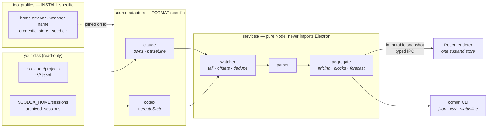

<h1 align="center">ccmon</h1>

<p align="center"><b>A live dashboard for everything Claude Code and Codex CLI do on your machine.</b></p>

<p align="center">
  <a href="https://github.com/iskandarputra/ccmon/actions/workflows/ci.yml"></a>
  <a href="LICENSE"></a>
  
  
  
  
  
</p>

<p align="center">
  <!-- ?v= is a cache-buster: GitHub proxies README images and serves the old
       bytes from cache long after the file changes. Bump it whenever the gif
       is re-recorded, or the page keeps showing the previous build. -->
  
</p>

<p align="center"><i>A scripted tour across a synthetic multi-account dataset, recorded with <code>npm run promo</code>.</i></p>

---

Claude Code and Codex CLI already write every response they give you, with
exact token counts, to local log files. ccmon watches those files and turns
them into numbers you can actually read. What today cost. How hot your 5-hour
window is running. Which model is eating the budget. When your limits reset.

Both tools, in one dashboard, side by side — with each one's own accounts,
plans and rate limits.

**No API key. No setup. No telemetry.**

## Quick start

```bash
git clone https://github.com/iskandarputra/ccmon.git
cd ccmon
npm install
npm run dev
```

That's it. ccmon finds your data on its own:

| Tool | Where it looks |
|---|---|
| **Claude Code** | `~/.claude/projects/`, plus any sibling `~/.claude-<name>` root from a multi-account setup, and `$CLAUDE_CONFIG_DIR` |
| **Codex CLI** | `${CODEX_HOME:-~/.codex}/sessions/` and `archived_sessions/` |

It indexes your history, then follows along. New responses appear within a
second. First index is a few seconds for a normal history; allow a minute if
you have thousands of sessions.

> **Prefer a binary?** Grab a `.deb`, `.AppImage`, Windows installer or macOS
> `.dmg` from [Releases](https://github.com/iskandarputra/ccmon/releases), or
> see [Build installers](#build-installers).

## The tour

Seven pages, reachable from the left rail or with a number key.

<table>
  <tr>
    <td width="50%"><b>Pulse</b> <code>1</code><br><sub>Today, the current 5-hour block, live plan limits, and a feed that ticks as you work.</sub></td>
    <td width="50%"><b>Analytics</b> <code>2</code><br><sub>Economics, ROI and forecasting — plus daily model stack and cumulative burn.</sub></td>
  </tr>
  <tr>
    <td></td>
    <td></td>
  </tr>
  <tr>
    <td><b>Projects</b> <code>3</code><br><sub>Spend per repo in four layouts — split, grid, table, and a force-directed knowledge graph.</sub></td>
    <td><b>Accounts</b> <code>4</code><br><sub>Every login, plan and rate limit side by side, across both CLIs.</sub></td>
  </tr>
  <tr>
    <td></td>
    <td></td>
  </tr>
  <tr>
    <td><b>3D canvas</b> <code>5</code><br><sub>Nine ways to slice your usage, seven ways to draw each one.</sub></td>
    <td><b>AI advisor</b> <code>6</code><br><sub>Ask questions about your own usage. Sends aggregates only — never transcripts.</sub></td>
  </tr>
  <tr>
    <td></td>
    <td></td>
  </tr>
  <tr>
    <td colspan="2"><b>Settings</b> <code>-</code><br><sub>Seventeen themes, 160+ currencies, cost mode, data roots, exports.</sub></td>
  </tr>
  <tr>
    <td colspan="2"></td>
  </tr>
</table>

A `⌘`/`Ctrl`+`K` command palette jumps anywhere and runs actions (rescan,
refresh limits, toggle privacy mode). `⌘`/`Ctrl`+`J` opens the advisor drawer
from any page; `⌘`/`Ctrl`+`P` blanks every dollar figure on screen.

## What it knows

<details>
<summary><b>Your real limits — and when you'll hit them</b></summary>
<br>

For Claude Code, ccmon reads the same numbers the `/usage` screen reads, live.
Then it learns your pace and tells you when you'll hit the cap — *"caps around
Friday 1am at this pace"* is more useful than a percentage.

For Codex, the limits are written into the session log itself, so ccmon reads
them with **no network call at all**. They carry an "as of" stamp because they
are only ever as fresh as your last real turn — the card uses a hollow, still
dot rather than the pulsing live one, and says so.

</details>

<details>
<summary><b>Every account, side by side — across both tools</b></summary>
<br>

ccmon shows each account's identity, plan and limits at once, whichever CLI it
belongs to, and how many sessions each one has running right now.

When a Claude account is about to cap while another sits idle, it tells you,
and hands you the exact `claude-cross-resume` command to pick up where you left
off on the account that still has room. Codex gets the same treatment via
`codex-cross-resume`. A setup wizard writes the per-shell `claude-*` and
`codex-*` wrappers for you.

Live session counts come from each tool's own registry, never from file
mtimes: Claude Code keeps `<root>/sessions/<pid>.json`, Codex keeps a lock file
per running thread. On Linux ccmon also compares `/proc/<pid>` start times, so
a **reused pid** can't report a long-dead session as running.

</details>

<details>
<summary><b>The current 5-hour block</b></summary>
<br>

Burn rate, countdown, and a projection of where the block lands. Plus 30 days
of block history, idle gaps included.

</details>

<details>
<summary><b>Plan value, cache economics, and what-if</b></summary>
<br>

- **Plan value** — what this month would have cost on the API, next to what
  your subscription costs. The gap is usually bigger than you'd expect.
- **Cache economics** — including the cost of walking away: leave a session
  longer than the cache TTL and your next message re-writes context you already
  paid for. ccmon counts exactly what that habit costs.
- **What-if** — every request re-priced onto another model. An all-Sonnet month
  and an all-Haiku month, next to what you actually spent.

</details>

<details>
<summary><b>Both tools priced properly</b></summary>
<br>

Codex's tokens are cumulative and its `input_tokens` **includes the cache**, so
a naive reading double-charges every cached prompt token. Its long-context tier
starts at **272K**, not Anthropic's 200K. A forked Codex rollout replays its
parent's turns rewritten to the fork instant, which defeats a timestamp-based
dedupe and bills the parent's whole history twice.

ccmon handles each of those, and `npm run parity` proves the Claude side still
matches ccusage exactly.

</details>

<details>
<summary><b>The small stuff</b></summary>
<br>

Tool usage. Stop reasons. Compactions. Subagent spend. Spike days. Streaks.
Context-window pressure. Historical pricing, so old months keep their old
rates. Seventeen themes (dracula pro by default), and your costs in any of 160+
currencies including the top ten crypto, refreshed hourly.

</details>

## Can I trust the numbers?

Yes, and you can check.

```bash
npm run parity              # vs ccusage, against your real ~/.claude
npm run parity -- --fixture # vs a committed corpus — no local history needed
```

An automated parity test cross-checks the token math against
[ccusage](https://github.com/ccusage/ccusage) (MIT), the established CLI for
coding-agent usage reports. Current drift is **0.000 percent** — an exact
integer match on all four token fields. **824 unit tests** cover the parsing,
pricing, block, forecast, account and shell-integration logic, and CI runs them
on Linux, macOS *and* Windows on every push.

Costs are API list prices. On a Pro or Max subscription, read them as
API-equivalent value rather than an invoice. Where a number is a heuristic, the
panel says so: every analysis has a small **"why?"** button explaining exactly
how it is computed and where it stops being reliable.

## Privacy

Everything stays on your machine, with a small number of deliberate exceptions
you can see and control in settings:

| What | When | Direction |
|---|---|---|
| Model prices (LiteLLM, models.dev) | daily, cached, optional | read-only |
| Claude plan limits | every 60s, using the login Claude Code already stored | read-only |
| Currency rates (open.er-api.com, CoinGecko) | hourly | read-only |
| Re-login | only when you click "Log in" | token refresh |
| AI advisor | only when you ask it something | sends **aggregates only** |
| DeepSeek balance | every 5 min, only if you connect a key | read-only |

**Codex adds none of these.** Its rate limits, plan and identity are all read
from files it already wrote on your disk — no OpenAI request is ever made.

Turn **pricing offline** on and ccmon runs from bundled snapshots. Nothing is
written anywhere except your own disk. There is no telemetry, no analytics, and
no crash reporting.

## The `ccmon` command line

Every build ships a headless CLI that runs the whole pipeline under plain Node
— same data, same settings, no Electron.

```bash
ccmon json --range 30d --section totals,models --pretty
ccmon json | jq '.totals.cost'
ccmon csv days --since 20260101 > days.csv
ccmon statusline
```

<details>
<summary><b>Example output</b></summary>
<br>

```console
$ ccmon json --range 7d --section totals --pretty
{
  "totals": {
    "cost": 162.32,
    "in": 35040,
    "out": 1466474,
    "read": 87056532,
    "write": 5132566,
    "tokens": 1501514,
    "allTokens": 93690612,
    "entries": 1747,
    "sessions": 15,
    "firstTs": 1787673608544,
    "lastTs": 1788238431353
  }
}

$ ccmon statusline
$50.75 today / $23.71 block (4h 6m left) | $26.44/hr normal
```

Use it as a Claude Code statusline, in `~/.claude/settings.json`:

```json
{ "statusLine": { "type": "command", "command": "ccmon statusline" } }
```

On Windows, point it at the launcher (JSON needs the backslashes doubled):

```json
{ "statusLine": { "type": "command", "command": "C:\\Users\\me\\AppData\\Local\\Programs\\ccmon\\resources\\cli\\ccmon.cmd statusline" } }
```

</details>

<details>
<summary><b>Putting it on your PATH</b></summary>
<br>

The CLI ships at `<install>/resources/cli/index.cjs`. It is deliberately **not**
symlinked for you — that needs a root-run install hook, which isn't worth the
risk for a convenience — so link it once yourself:

```bash
# Debian/Ubuntu install
sudo ln -sf /opt/ccmon/resources/cli/index.cjs /usr/local/bin/ccmon

# from a source checkout
npm run build:cli && sudo ln -sf "$PWD/dist-cli/index.cjs" /usr/local/bin/ccmon

ccmon --help
```

On **Windows** there is no shebang and no executable bit, so the build ships a
`ccmon.cmd` launcher next to `index.cjs`. Add its folder to `PATH`:

```powershell
$env:Path += ";$env:LOCALAPPDATA\Programs\ccmon\resources\cli"
ccmon --help
```

</details>

It reads the same data and settings as the app, **never writes anything**, and
never polls your login — plan limits come from the history the app already
persisted. `json` and `csv` are never masked by privacy mode: they are data for
scripts, and blanking numbers there would corrupt output rather than protect it.

## Running Claude Code on DeepSeek

Claude Code talks to any Anthropic-compatible endpoint, so it can run on
DeepSeek — roughly **35× cheaper** per input token than Opus, **86× cheaper**
per output token. Doing it by hand means knowing ten environment variables,
several undocumented. ccmon generates them.

<details>
<summary><b>Four steps</b></summary>
<br>

1. **Get a key** at [platform.deepseek.com](https://platform.deepseek.com), and
   connect it in ccmon's **DeepSeek** panel. That enables balance and runway
   tracking, and the setup wizard reuses the same key — you never type it twice.
2. **Accounts → multi-account setup → `~/.claude-` `deepseek` → create.** Its
   own config dir is what keeps DeepSeek usage separately attributed; a
   transcript records no account identity, so sessions written into `~/.claude`
   are indistinguishable from your subscription work.
3. On the new row, click **+ env → DeepSeek**. That fills in the base URL, the
   model mapping for all three tiers, the capability flags Claude Code needs to
   keep effort/thinking enabled on an unrecognised model, and a
   `${ccmon:deepseek-key}` reference to your stored key.
4. **Preview**, check the diff (the key shows masked — the real value is only
   written to disk), then **apply**. Open a new terminal.

```bash
claude-deepseek                        # a session on DeepSeek
claude-deepseek-from-personal <id>     # move a running session onto DeepSeek
```

Both wrappers export the same environment, so a resumed session keeps DeepSeek
rather than silently falling back to Anthropic. ccmon prices DeepSeek models
from its own bundled catalog, so the spend shows up in every view alongside
your Claude usage.

Model ids move. If DeepSeek renames one, edit the env box — it is plain
`KEY=value` text, and the preset is only a starting point.

</details>

The key is stored `0600` and encrypted via the OS keyring (`safeStorage`); when
no keyring exists, ccmon reports it as unencrypted rather than pretending
otherwise. `/user/balance` is the only account endpoint DeepSeek publishes — no
usage, quota or rate-limit API — so burn, runway and the computed-vs-observed
drift check are all measured locally from the balance falling.

## Under the hood

A pure Node service layer (discover, tail, parse, dedupe, price, aggregate)
lives in the Electron main process and pushes immutable snapshots over a typed
IPC bridge to a sandboxed React renderer with one zustand store. The services
never import Electron, which is why the whole pipeline also runs headless.



Supporting a second CLI takes two small registries, joined by id. A **source
adapter** owns what is format-specific — where the logs are, which files carry
usage, how a line becomes an entry. A **tool profile** owns what is
install-specific — which env var selects the home, what a shell wrapper is
called, where the credentials live. They stay separate because the adapters are
stateless singletons that the headless CLI imports under plain Node, while
account setup writes shell startup files and reads credential stores.

Details in [docs/architecture.md](docs/architecture.md). The data contracts live
in [docs/v2-spec.md](docs/v2-spec.md), and what's planned next in
[docs/analytics-roadmap.md](docs/analytics-roadmap.md).

## Configuration

Optional, at `~/.config/ccmon/config.json`:

```json
{
  "claudeDirs": ["/extra/claude/root"],
  "codexDirs": ["/extra/codex/home"],
  "pricing": {
    "my-custom-model": { "in": 5, "out": 25, "w5m": 6.25, "w1h": 10, "read": 0.5 }
  },
  "modelAliases": { "claude-opus-5": "opus" },
  "projectAliases": { "/home/me/work/api-v2": "api" }
}
```

<details>
<summary><b>What each key does</b></summary>
<br>

- **`claudeDirs`** adds data roots beyond `~/.claude` and `~/.config/claude`;
  **`codexDirs`** does the same for Codex homes beyond `$CODEX_HOME` (which
  ccmon also accepts as a comma-separated list). Each is routed to its own
  reader, so a Claude root is never parsed as a Codex home.
- **`pricing`** takes per-MTok overrides; keys are case-insensitive regexes and
  always win. They reach every field the engine uses — tier rates, the threshold
  those tiers start at (`tierAt`; 200k for Anthropic, 272k for OpenAI), the
  context window and the `-fast` multiplier, not just the five base rates.
- **`modelAliases`** / **`projectAliases`** rename model ids and project paths
  **for display only**. They are applied at format time, never before pricing or
  grouping — aliasing two ids to one label would merge distinct models and break
  parity.

</details>

## Build installers

```bash
./build.sh             # current platform (Linux: .deb + .AppImage)
./build.sh deb         # Debian/Ubuntu package
./build.sh appimage    # portable AppImage
./build.sh win         # Windows NSIS installer + portable exe
./build.sh mac         # macOS .dmg + .zip (run on a Mac; unsigned)
./build.sh all         # Linux + Windows
```

Artifacts land in `release/`. Install the deb with
`sudo apt install ./release/ccmon-*.deb`. Tagged pushes cut a GitHub release
with Linux, Windows and macOS artifacts attached:

```bash
git tag v1.15.0 && git push origin v1.15.0
```

<details>
<summary><b>macOS: first launch, and the Keychain</b></summary>
<br>

The Mac builds are unsigned and un-notarised — ccmon has no paid Apple
Developer ID — so Gatekeeper refuses a downloaded `.dmg` with *"ccmon is damaged
and can't be opened"*. That message is about the missing signature, not the
download. Clear the quarantine attribute once after copying the app to
`/Applications`:

```bash
xattr -dr com.apple.quarantine /Applications/ccmon.app
```

Both `arm64` and `x64` builds are published; take the one matching your Mac.
Building from source (`./build.sh mac`) produces an app that runs without this
step.

**Plan limits on macOS.** Claude Code stores its login in the login Keychain,
not in `~/.claude/.credentials.json`. ccmon reads that Keychain item (via
`security(1)`, read-only) so live plan limits, the tray cap row, the near-cap
alert and the AI advisor work there. One limitation: the item carries nothing
identifying a `CLAUDE_CONFIG_DIR`, so it is only used for the default `~/.claude`
account — a second account root on macOS needs its own `.credentials.json`, and
ccmon says so instead of guessing.

</details>

## Development

```bash
npm run dev        # hot-reload dev build
npm test           # unit tests (vitest)
npm run smoke      # full pipeline against your real data, no Electron
npm run parity     # token parity vs ccusage (npx + network)
npm run typecheck  # strict tsc, both processes
npm run lint       # eslint (correctness only; Prettier owns formatting)
npm run cli -- json --range 30d   # the headless CLI, straight from source
```

<details>
<summary><b>Re-recording the promo assets</b></summary>
<br>

```bash
npm run promo          # record → encode → stills
npm run promo:record   # film the tour into promo/take/
npm run promo:encode   # tour mp4 + teaser mp4 + docs/media/ccmon-hero.gif
npm run promo:shots    # one still per page into docs/media/
```

The shoot drives the **built** app over CDP against a synthetic multi-account
world, so it never films your real transcripts. A window appears for ~45
seconds — hands off the mouse.

The pipeline is written to fail loudly rather than produce a wrong film:

- every DOM hook lives in `scripts/promo/selectors.ts`, and a missing required
  one **throws** with the selector and its owning file
- view hotkeys are derived from `Sidebar.tsx`, never hardcoded
- the tour films only pages the **sidebar actually renders** — views that still
  have a hotkey but were dropped from navigation are excluded by construction
- the throwaway `$HOME` is scrubbed and then **re-verified at every stop**
- `scripts/__tests__/promo-contract.test.ts` pins all of the above, so a
  renderer rename fails `npm test` rather than a recording weeks later

</details>

See [CONTRIBUTING.md](CONTRIBUTING.md) before opening a PR.

## License

MIT © [Iskandar Putra](https://www.iskandarputra.com)
