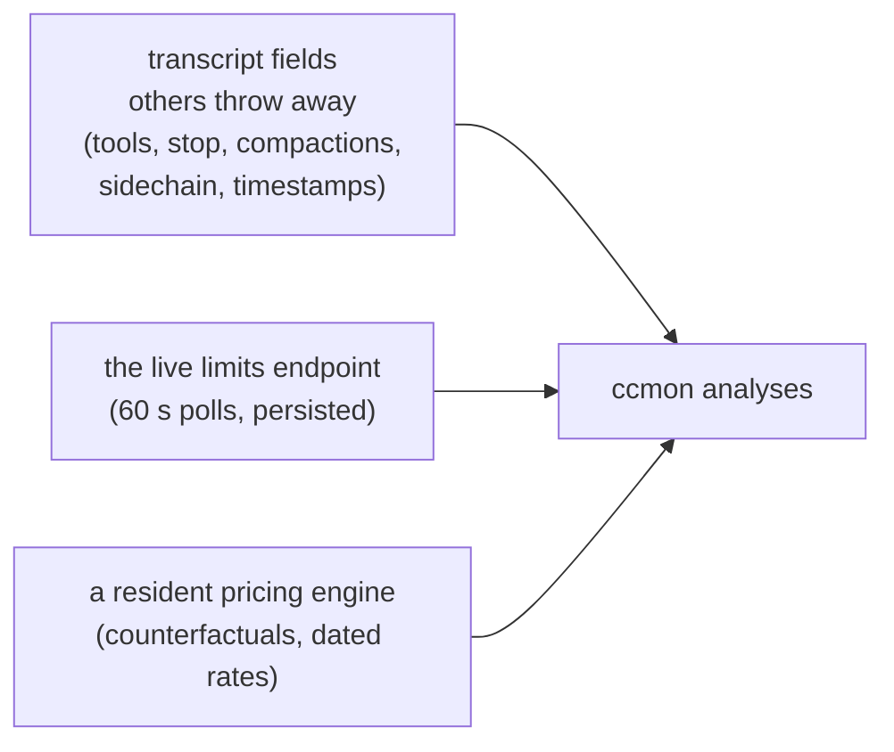

# Analytics roadmap

What ccmon analyzes beyond ccusage, what's still open, and why the open
items are open. ccusage covers daily/weekly/monthly/session rollups, blocks
with burn rate, per-model breakdowns, and a statusline. ccmon's edge sits
in three places a stateless CLI structurally can't reach:

Claude Code data only, by scope. Contracts for everything shipped live in
`v2-spec.md`; that file stays authoritative.

## Tier A — computed from already-parsed fields

| Analysis | Status | Where | Notes |
|---|---|---|---|
| Plan value / ROI | shipped | Insights (spec §6) | API-equivalent month cost vs subscription price, value multiple, projected month-end multiple. Renderer-only. |
| Cache-TTL idle cost | shipped | `cache.idle` (spec §4.1) | "Cost of walking away": gap-expired cache re-writes, priced at write minus read rate. |
| Weekday-adjusted forecast | shipped | Insights (spec §6) | Weekday profile per remaining day, ±1σ residual band. |
| Anomaly flagging | shipped | Insights | MAD spike days on the spend trend; spike-day and costliest-session records. Follow-up: a "why was this day expensive" drill-down. |
| Block utilization histogram | shipped | Blocks view | Fill distribution vs the biggest-ever block; light-block count. |
| Per-project / per-model cache hit | shipped | Projects, Models | `read`/`write` on ProjectRow; hit columns. |
| What-if re-costing | shipped | `whatIf` (spec §4.2) | Every entry re-priced onto each top model; panel on Models, lanes in 3D. |
| Subagent spend share | shipped | `sidechain` (spec §4.3) | A floor, not a ceiling: mirrored usage dedupes to the parent copy. |

## Tier B — needed the parser to keep dropped JSONL fields

| Analysis | Status | Where | Notes |
|---|---|---|---|
| Tool-use analytics | shipped | `toolUse` (spec §4.4) | Invocations, turn-cost attribution, daily split. Follow-up: tokens attributable to tool RESULTS needs user-side lines, which the parser still skips. |
| Stop-reason distribution | shipped | `stopReasons` (spec §4) | max_tokens truncations surface as a record. |
| Compaction tracking | shipped | `compactions` (spec §1, §4) | Total plus per-session counts. Follow-up: costing the post-compaction re-read. |
| Latency / throughput | parked | — | Checked 2026-06: assistant lines carry no duration field, so honest tokens/sec is not derivable. A timestamp-gap proxy would include tool execution time and mislead. |
| Thinking-token share | parked | — | Waiting on usage exposing reasoning tokens separately from `out`. |

## Tier C — needed persistence beyond the transcripts

| Analysis | Status | Where | Notes |
|---|---|---|---|
| Limits history + time-to-cap forecast | shipped | spec §5.3 | 60 s polls persisted; least-squares fit; "caps ~thu 15:04 at this pace"; 7-day sparkline. |
| Limit-hit retrospective | shipped | spec §5.3 | Resets observed and how many happened at ≥95%. Follow-up: correlate with transcript reset markers; best-time-to-start hints. |
| Historical pricing | shipped | spec §2 | Dated catalog layers + `engine.costAt`. Builds forward from first run; the past can't be refetched. |
| Per-account dashboard + cross-account headroom | shipped | spec §5.2, §5.6 | Live limits now polled for every account (not just the scoped one); `AccountsView` shows all logins side by side; `crossAccountAdvice` nudges to the account with room. Follow-up: per-account lifetime spend (needs a per-root rollup in the aggregate). |
| Shell-aware multi-account setup wizard | shipped | spec §8 | OS-aware (Linux/macOS POSIX shells incl. macOS `~/.bash_profile`; Windows PowerShell `$PROFILE`). Detects the login shell (passwd over `$SHELL`), generates the `claude-*` wrappers into one managed file, links it idempotently from the chosen rc, installs the cross-resume helper (Unix only); preview-before-apply. Conflict-aware: detects pre-existing hand-written `claude-*` defs and (opt-in) tidies the single-line ones with a reversible comment prefix. Limitation: a freshly created account dir needs an app relaunch for live file-watching. |

## Engineering debts (from the 2026-06 ccusage review)

| Debt | Status | Notes |
|---|---|---|
| Tests | paid | 103 vitest cases over the pure services + renderer libs plus `npm run parity` (verified ≤0.004% token drift vs ccusage). CI runs typecheck + tests on every push. |
| Performance | partly paid | Per-entry dollars resolve exactly once (costMemo; blocks and the feed reuse it); what-if rows resolve outside the entry loop. Measured ~200–250 ms per full recompute at 45k entries; the cost is Map/Set churn in the main pass, not pricing. The remaining fix is architectural: incremental day-bucket aggregation (re-reduce only buckets whose entries changed; full recompute stays as the rescan path). Do it before the dataset passes ~200k entries. |
| Fragile dependencies | paid | The usage endpoint fails loudly on shape changes (guard in `accounts.ts`); plan prices live in `shared/plans.ts` as a single dated table. er-api/CoinGecko stay free tiers by design, both keep-last-good with verbose errors. |
