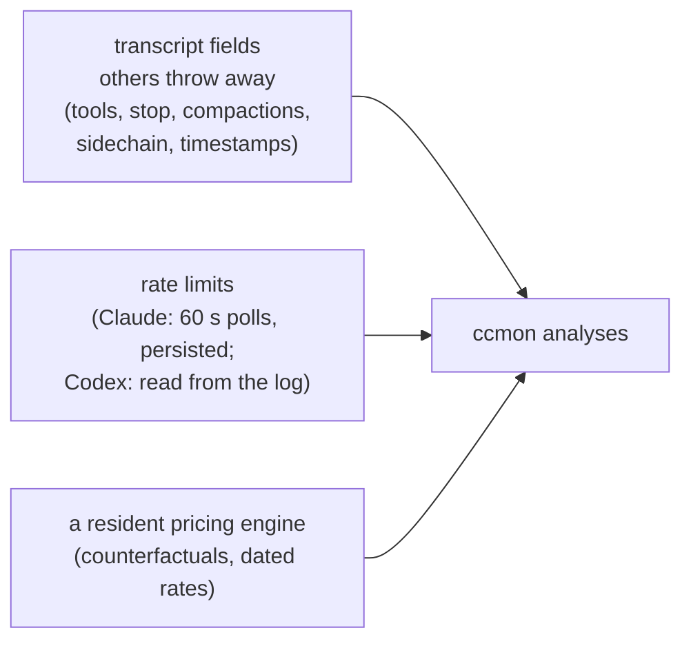

# Analytics roadmap

What ccmon analyzes beyond ccusage, what's still open, and why the open
items are open. ccusage covers daily/weekly/monthly/session rollups, blocks
with burn rate, per-model breakdowns, and a statusline. ccmon's edge sits
in three places a stateless CLI structurally can't reach:

Claude Code and Codex CLI data, by scope. Contracts for everything shipped
live in `v2-spec.md`; that file stays authoritative.

## Tier A — computed from already-parsed fields

| Analysis | Status | Where | Notes |
|---|---|---|---|
| Plan value / ROI | shipped | Insights (spec §6) | API-equivalent month cost vs subscription price, value multiple, projected month-end multiple. Renderer-only. |
| Cache-TTL idle cost | shipped | `cache.idle` (spec §4.1) | "Cost of walking away": gap-expired cache re-writes, priced at write minus read rate. |
| Weekday-adjusted forecast | shipped | Insights (spec §6) | Weekday profile per remaining day, ±1σ residual band. |
| Anomaly flagging | shipped | Insights | MAD spike days on the spend trend; spike-day and costliest-session records. "Why was this day expensive" drill-down SHIPPED: click any day → `dayBreakdown` IPC recomputes top projects/models/sessions, tool turns, compactions, new-project debuts, vs-median. |
| Block utilization histogram | shipped | Blocks view | Fill distribution vs the biggest-ever block; light-block count. |
| Per-project / per-model cache hit | shipped | Projects, Models | `read`/`write` on ProjectRow; hit columns. |
| What-if re-costing | shipped | `whatIf` (spec §4.2) | Every entry re-priced onto each top model; panel on Models, lanes in 3D. |
| Subagent spend share | shipped | `sidechain` (spec §4.3) | A floor, not a ceiling: mirrored usage dedupes to the parent copy. |

## Tier B — needed the parser to keep dropped JSONL fields

| Analysis | Status | Where | Notes |
|---|---|---|---|
| Tool-use analytics | shipped | `toolUse` (spec §4.4) | Invocations, turn-cost attribution, daily split. Tool-RESULT volume SHIPPED: the parser now sizes user-side `tool_result` lines into a separate `toolresult` marker stream (never billed — parity unaffected); `snapshot.toolResults` reports count + chars + chars/4 est-tokens. Still open: per-tool-name split (needs tool_use_id→name linking). |
| Stop-reason distribution | shipped | `stopReasons` (spec §4) | max_tokens truncations surface as a record. |
| Compaction tracking | shipped | `compactions` (spec §1, §4) | Total plus per-session counts. Post-compaction re-read cost SHIPPED: `snapshot.compactionReread` sums the input+cache-read cost of the first turn after each compaction (a floor — first turn only). |
| Latency / throughput | parked | — | Checked 2026-06: assistant lines carry no duration field, so honest tokens/sec is not derivable. A timestamp-gap proxy would include tool execution time and mislead. |
| Thinking-token share | parked | — | Waiting on usage exposing reasoning tokens separately from `out`. |

## Tier C — needed persistence beyond the transcripts

| Analysis | Status | Where | Notes |
|---|---|---|---|
| Limits history + time-to-cap forecast | shipped | spec §5.3 | 60 s polls persisted; least-squares fit; "caps ~thu 15:04 at this pace"; 7-day sparkline. |
| Limit-hit retrospective | shipped | spec §5.3 | Resets observed and how many happened at ≥95%. Best-time-to-start hint SHIPPED (Insights): the lightest active hour-of-day from the 30-day rhythm heatmap — when limit windows have the most headroom. Still open: correlate with transcript reset markers. |
| Historical pricing | shipped | spec §2 | Dated catalog layers + `engine.costAt`. Builds forward from first run; the past can't be refetched. |
| Per-account dashboard + cross-account headroom | shipped | spec §5.2, §5.6 | Live limits now polled for every account (not just the scoped one); `AccountsView` shows all logins side by side; `crossAccountAdvice` nudges to the account with room. Per-account lifetime spend SHIPPED: `accountSpend()` rolls up lifetime/30d/7d/today $, tokens, sessions per source root (scope-independent) → `snapshot.accountSpend`, rendered on each account card. |
| OpenAI / Codex pricing | shipped | spec §2 | The pricing snapshot only ever carried anthropic and deepseek, so no gpt-* model resolved to a rate: Codex tokens were counted perfectly and billed at **$0** — measured $1.05 and $1.76 hidden on this repo's own corpus. models.dev is the source and LiteLLM deliberately is not, because LiteLLM lacks the long-context bands and its layers are consulted first. |
| Codex fork / subagent replay | shipped | — | A forked rollout replays its parent's turns REWRITTEN to the fork instant, which defeats the content-addressed dedupe key (same tokens, new timestamp) and bills the parent's history twice. `codex-replay.ts` matches on token values instead, anchored on the parent's stream or, when that is gone, on the burst Codex writes at the fork instant. Gated on `session_meta` declaring a parent so an ordinary session is never touched. Unverifiable on this machine by design — zero forked sessions and zero burst heads in the corpus — so it is covered by fixtures and by proving the real corpus stays byte-identical. |
| Running sessions per account | shipped | spec §5.2 | How many sessions each account has going right now, and which — read from each tool's own registry rather than guessed from file mtimes. Claude keeps `<root>/sessions/<pid>.json` with a live busy/idle status; Codex keeps one lock file per session. Liveness is a pid probe everywhere plus a `/proc` start-time check on Linux that rules out a REUSED pid. Expands to show directory, status and uptime, which is the question you actually have when the count is 3 and you expected 1. |
| Plan named as a product | shipped | spec §5.2 | "team · 5x" described neither half of what was going on. The plan is the billing relationship and the tier is that SEAT's entitlement, set per member on a Team org — `planLabel` composes them into "Team - Pro Max x5". Found by reading a real Team account whose Max 5x upgrade lived in `userRateLimitTier`, a field ccmon never looked at, so it reported no tier at all. |
| Codex usage limits | shipped | spec §5.2 | Recorded as **not possible** for a few hours, on the assumption that limits need an endpoint. They do not: Codex writes `rate_limits` onto every `token_count` event, so ccmon reads them with NO network call and no credentials — strictly better than the Claude path's 60 s poll, and something ccusage ignores entirely. Verified field-for-field against Codex's own `/status`: `window_minutes 43200` is its "Monthly limit", `used_percent 99` is its "0% left" (it shows remaining), `resets_at` is in SECONDS. Free plans get one monthly window; paid add a 300-minute primary (5 h) and a 10080-minute secondary (weekly), plus purchasable credits. The honest limit is FRESHNESS, not availability: the block rides on a real turn, and `/status` and `/usage` write nothing, so a reading can be days stale — hence `observedAt` and the card's "as of" stamp in place of the live dot. |
| Codex long-context pricing tier | shipped | spec §2 | Parked for about an hour, on the wrong assumption that it needed a per-request context measure. It does not: models.dev publishes a 272K CONTEXT band per model and the engine already billed a whole request at tier rates once a threshold was crossed — the threshold was simply hardcoded to Anthropic's 200K. `RateRow.tierAt` makes it per-model. |
| Codex cross-account resume | shipped | spec §8 | `codex-cross-resume` (bash + PowerShell), the twin of the Claude helper. Three real differences, all forced by the format: the session id is a uuid INSIDE the filename (`rollout-<ts>-<uuid>.jsonl`) and is read from the file rather than parsed from the name; the destination must preserve the `sessions/YYYY/MM/DD/` path or `codex resume` never finds it; and a rollout under `archived_sessions/` is restored into the destination's `sessions/`, because resuming an archived session IS un-archiving it. Same overwrite policy as the Claude twin (more lines == newer, always backed up first). |
| Shell-aware multi-account setup wizard | shipped | spec §8 | OS-aware (Linux/macOS POSIX shells incl. macOS `~/.bash_profile`; Windows PowerShell `$PROFILE`). Detects the login shell from the system account record over `$SHELL` (`getent passwd` on Linux, `dscl` on macOS — no `getent` there, and a Finder-launched app may have no `$SHELL` at all), never returning an empty shell list, generates the wrappers into ONE MANAGED FILE PER TOOL (`claude-accounts.sh`, `codex-accounts.sh`) so a Claude-only user's file never churns because a Codex account appeared, links them idempotently from one guarded rc block that sources every tool file, installs each tool's cross-resume helper (bash on POSIX, PowerShell on Windows); per-account `env` so an alternate-provider account (Claude Code on DeepSeek) is expressible; preview-before-apply. Conflict-aware: detects pre-existing hand-written wrapper defs and (opt-in) tidies the single-line ones with a reversible comment prefix. Cross-resume pairs partition BY TOOL — a `claude-work-from-codex-personal` wrapper would copy a Claude transcript into a Codex home. The rc block is REPLACED in place when stale rather than only appended, which is what let it grow a second source line without stranding already-linked users. Limitation: a freshly created account dir needs an app relaunch for live file-watching. |

## Engineering debts (from the 2026-06 ccusage review)

| Debt | Status | Notes |
|---|---|---|
| Tests | paid | 824 vitest cases over the pure services, renderer libs and the CLI. CI runs typecheck + tests on every push, `npm run parity` stays manual (needs npx + network); it now pins `CLAUDE_CONFIG_DIR` for the ccusage subprocess, without which a run from a `claude-<name>` wrapper shell compared two different accounts and reported the mismatch as token drift. |
| Scriptable output | shipped | `cli/` — `ccmon json \| csv \| statusline`, a separate no-Electron bundle over the same services. Closes ccusage's `--json`/statusline gap and exposes ccmon-only analytics (`whatIf`, `cache.idle`, limits forecast) that a stateless CLI can't compute. Read-only: limits come from the persisted history, never the OAuth poller. Ships in installers as an extraResource (`<install>/resources/cli/index.cjs`, verified executable from a real `dist:dir` build); linking it onto PATH is one documented `ln -sf` rather than an untested root-run install hook. |
| Cost-mode honesty | shipped | The cost-mode notes now say what each option will REALLY do given the transcripts: with no recorded costs, `display` reads "shows $0.00" and `auto` reads "identical to calculate", plus a warning row when the user is actually sitting on display-with-nothing-to-show. Driven by `reconcile.compared`, so it tracks reality instead of a hardcoded assumption. Also styled `.set-err`, which SettingsView had been referencing with no CSS rule at all. |
| Close to tray | shipped (opt-in) | `settings.closeToTray`, default false. Engages only when a tray exists; `state.quitting` + a `before-quit` hook keep every real quit path working; a one-time notification explains the first hide. |
| Cost reconciliation | shipped, but dormant by design | `snapshot.reconcile` compares recorded `costUSD` against a fresh token-based calculation, ALWAYS calculating independently of the cost mode (under 'auto'/'display' the snapshot's cost already IS the recorded value, so a naive version reports 0% drift and says nothing). Unpriced models are skipped rather than scored as total mismatches, and `coverage` guards against reading a tiny sample as a clean bill. **Currently dormant: Claude Code writes no per-message cost** (verified across 5 roots / ~107k entries — coverage 0%), so the Insights panel is gated on `compared > 0`. It costs nothing while empty and lights up if the field returns. ccusage's `--debug`/`--debug-samples`, reframed as an analysis. |
| Privacy mode | shipped | `settings.privacyMode` blanks every money figure at format time across the renderer, the tray AND the CLI statusline — a toggle that only masked the window would be defeated by a tray tooltip. `json`/`csv` stay unmasked by design. ccusage's `--no-cost`, reframed as a GUI toggle. |
| Billing-channel detection | shipped | `shared/providers.ts` is now rule-based with a `deployment` channel (first-party / bedrock / vertex). Fixes a real wrong-conclusion bug: Bedrock and Vertex ids previously resolved to NO provider, so they were bucketed as "Other" AND `isApiKeyOnly` returned false — meaning ccmon showed a subscription-savings comparison to consumption-billed users. |
| Display aliases | shipped | `modelAliases` / `projectAliases` in the user config, display-only (`shared/aliases.ts`, installed via `format.ts#configureAliases`). Closes ccusage's `--project-aliases` / `CCUSAGE_MODEL_ALIASES` / `modelLabelAliases`; the motivating case is an unreadable Bedrock ARN. Never applied before pricing or grouping, so parity is untouched. |
| Configurable block length | shipped | `settings.blockHours` (1-24, default 5) threaded as a parameter through `computeBlocks`; CLI `--session-length`. The UI states plainly that only 5h matches Anthropic's billing window and anything else reframes blocks as personal work sessions. |
| Multi-source seam | shipped, and proven | `electron/services/adapters/` — `SourceAdapter {id, label, detectRoots, owns, parseLine, createState?}` + registry; the watcher takes tagged roots and stamps `entry.agent`. TWO real adapters ship: `claude` and `codex`. Codex is what proved the seam — fitting it forced `createState` onto the interface, because a Codex usage line is not self-describing (model from an earlier `turn_context`, speed tier from an earlier `thread_settings_applied`), which no amount of designing against one format would have surfaced. Deliberately NOT chasing ccusage's 16 adapters. |
| Account-layer seam | shipped | `shared/tools.ts` + `electron/services/tools/` — the twin of the adapter seam for what is INSTALL-specific rather than format-specific: home env var, wrapper naming, seed dir, credential store. Kept as a separate interface because adapters are stateless singletons the CLI imports under plain node, while account setup writes rc files and reads credentials. The pure half lives in `shared/` so the renderer imports it too, retiring a hand-copied `suggestWrapperName` that had to be kept in sync by eye. A drift test asserts every `ADAPTERS` id has a `TOOLS` entry — without it a new adapter yields accounts with no label and no wrapper, silently. |
| Timezone | shipped | `settings.timezone` (IANA name, '' = system) through `shared/daykey.ts` — the single timestamp→calendar point. Closes ccusage's `--timezone`, and the CLI takes `--timezone/-z` too. Zone changes re-bucket in one pass, no rescan. Verified on real data: Honolulu reports a different calendar day than Tokyo for the same instant. |
| Ambient surface | shipped | Tray indicator: today's spend, active-block cost + time left, burn, and the nearest live cap across ALL accounts. Strings come from the pure `status-text.ts` shared with the CLI statusline, so tooltip / menu / macOS title can't disagree. Degrades silently where no tray host exists. Still covers "running but behind" only — close-to-tray is an opt-in follow-up, deliberately not the default. |
| ccusage parity | paid, and the harness was wrong | Now **0.000% drift** — exact integer match on all four token fields vs ccusage v20.0.19, better than the ≤0.004% previously recorded. Getting there meant fixing `scripts/parity.ts`, not ccmon: it summed ALL ccmon entries but only `claude-*` model breakdowns on the ccusage side, so once DeepSeek usage entered the transcripts (v1.9.0) the two sides compared different corpora and it reported ~47% input drift. The bug hid behind an *exact* cache-write match, because DeepSeek bills no cache writes — a reminder that one field agreeing perfectly while others drift is evidence about SCOPE, not about arithmetic. Per-day and per-model comparison is what localized it (both agreed everywhere), so the script now prints a per-day delta table on failure and compares ccusage's own published `totals` object. Do not reintroduce a model filter — see the CLAUDE.md gotcha. |
| Performance | partly paid | Per-entry dollars resolve exactly once (costMemo; blocks and the feed reuse it); what-if rows resolve outside the entry loop. Measured ~200–250 ms per full recompute at 45k entries; the cost is Map/Set churn in the main pass, not pricing. Recompute ELISION shipped: `recomputeSig()` skips no-op periodic ticks (idle, same day, no active block, unchanged inputs) — the data path still forces a full rebuild, so correctness is unchanged. Parse-path PREFILTER shipped (`parser.mayCarryData`): a substring gate ahead of `JSON.parse` skips the ~29% of lines that cannot carry data, measured 41% faster over 154k real lines / 523 MB of JSON (3122 ms → 1843 ms) with byte-identical output. The remaining architectural fix — true incremental day-bucket aggregation (re-reduce only buckets whose entries changed) — is still open; do it before the dataset passes ~200k entries. |
| Fragile dependencies | paid | The usage endpoint fails loudly on shape changes (guard in `accounts.ts`); plan prices live in `shared/plans.ts` as a single dated table. er-api/CoinGecko stay free tiers by design, both keep-last-good with verbose errors. |
