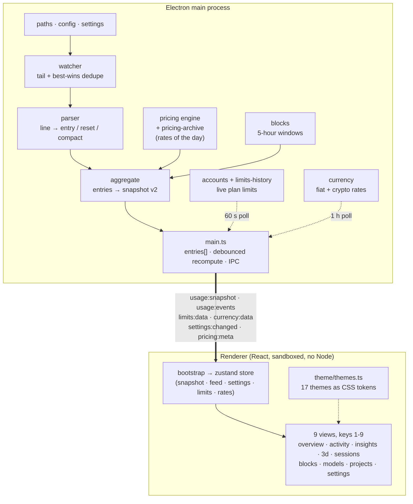
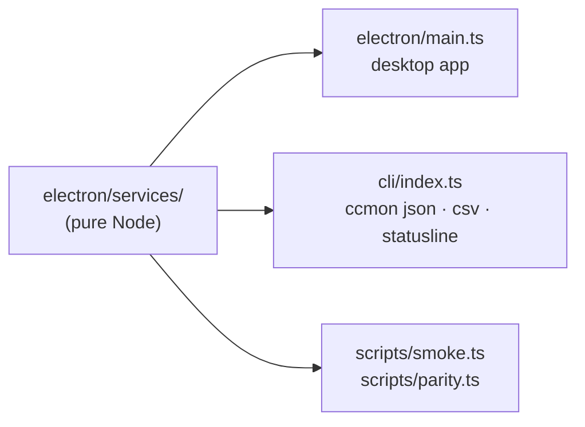
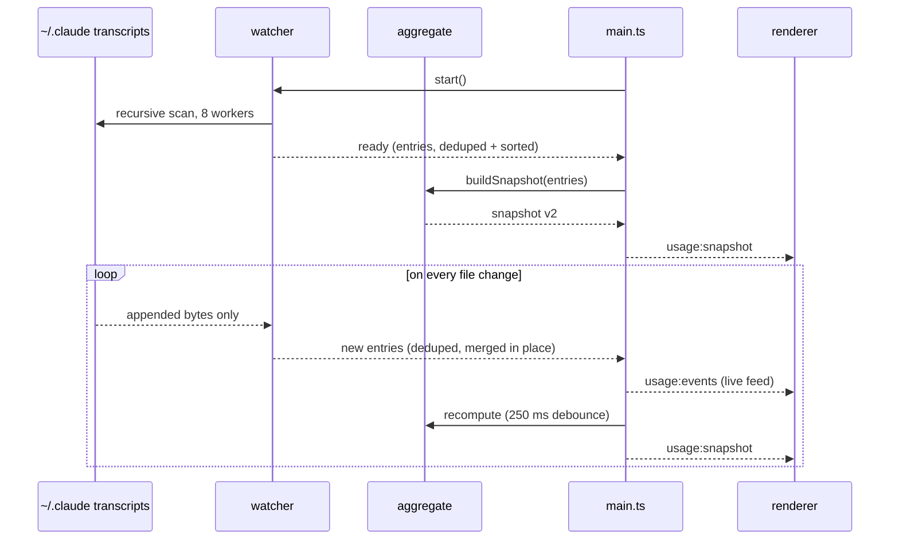

# Architecture

ccmon is two processes with one contract between them. A pure Node service
layer inside the Electron main process turns transcript files into an
immutable snapshot; a sandboxed React renderer draws whatever snapshot
arrives. The renderer holds no business logic.

## Process model

Everything inside `electron/services/` is pure Node with zero Electron
imports. That single rule is what makes the whole pipeline runnable headless
(`npm run smoke`) and unit-testable (`npm test`).

It also buys a second product surface for almost nothing. `cli/` is a separate
esbuild bundle (`dist-cli/index.cjs`, no Electron linked) that drives the same
services:

The CLI is strictly read-only and never polls: settings come from the app's
stored `settings.json` with flags overriding, plan limits come from the
persisted limits history rather than the OAuth endpoint (so the CLI can never
touch or rotate the Claude Code login), and the only possible network call is a
pricing refresh that `--offline` disables. `statusline` additionally windows
discovery by file mtime (`UsageWatcher.sinceMs`) to answer inside a shell
prompt; `json` and `csv` never do, because a windowed index would silently
understate lifetime totals.

## Data flow

Step by step:

1. **Discover.** `paths.ts` resolves data roots (`CLAUDE_CONFIG_DIR`,
   `~/.claude`, sibling `~/.claude*` roots, `~/.config/claude`, plus config
   extras). `CLAUDE_CONFIG_DIR` may be a comma-separated list — Claude Code
   accepts one, so a user can combine a live profile with an archive — and a
   leading `~` is expanded in every path, because shells don't expand it
   inside quotes. Discovery is
   recursive because transcripts live at several depths:
   `projects/<proj>/<session>.jsonl`, `<session-id>/subagents/agent-*.jsonl`,
   and `<session-id>/subagents/workflows/wf_*/agent-*.jsonl`.
2. **Index.** The initial scan reads every file through a small concurrency
   pool (8 workers), emitting progress to the renderer.
3. **Tail.** chokidar watches the tree. Per-file byte offsets plus a
   partial-line remainder make each read O(appended bytes). Files untouched
   for 7 days are indexed but not watched, keeping inotify usage
   proportional to recent activity. Truncation triggers a clean full rescan.
4. **Parse.** `parser.ts` keeps assistant lines with usage, turns
   "usage limit reached" API errors into reset markers and
   `isCompactSummary` lines into compaction markers. Cost is NOT priced
   here; entries carry raw token splits so cost-mode and pricing changes
   never rescan.
5. **Dedupe.** Best-wins, ccusage parity: streaming chunks repeat a
   `messageId:requestId` key with cumulative usage (largest wins), and
   subagent usage mirrored into parent transcripts keeps the non-sidechain
   copy. Merges mutate stored entries in place and also upgrade
   `tools` / `stop` from the later chunk.
6. **Price.** `pricing.ts` resolves per-token USD rates through layered
   sources with tiered >200k rates, 5m/1h cache-write tiers, and `-fast`
   multipliers. `pricing-archive.ts` records a dated layer whenever the
   catalog changes, so entries cost at the rates of their day
   (`engine.costAt`).
7. **Aggregate.** `aggregate.ts` reduces all entries into snapshot v2
   (contract: `v2-spec.md` §4): totals, daily/weekly/monthly series,
   sessions, projects, blocks, cache economics including idle-TTL cost,
   what-if re-pricing, tool/stop/compaction analytics, records.
8. **Publish.** main keeps the canonical `entries[]`, recomputes on a
   250 ms debounce (plus a 60 s timer for day rollover and block expiry),
   and pushes the snapshot over IPC.
9. **Poll.** Two background loops, both keep-last-good with verbose errors:
   live plan limits every 60 s (`accounts.ts`, persisted by
   `limits-history.ts` into sparklines, time-to-cap forecasts, and a cap
   retrospective) and display-currency rates hourly (`currency.ts`). Every
   stored dollar stays USD; conversion happens at format time in the
   renderer.

## Key decisions

- **Full recompute over incremental aggregation.** ~45k entries reduce in
  ~200 ms; the pass is debounced and per-entry dollars resolve exactly once.
  A full pass keeps every derived number consistent by construction. The
  honest limit: around ~200k entries this needs incremental day-bucket
  aggregation (planned, see `analytics-roadmap.md`).
- **Services are Electron-free.** The entire pipeline runs under plain Node
  against real data. Fast feedback, no GUI required.
- **Snapshot-push IPC.** One store, selector subscriptions, no fetch
  waterfalls. The renderer renders; it does not compute.
- **Security posture.** `contextIsolation: true`, `sandbox: true`,
  `nodeIntegration: false`, strict CSP injected at build time, window-open
  denied, app menu removed. The renderer can only call what the preload
  exposes.
- **Themes are data.** Every theme defines the same `TOKEN_KEYS` set of CSS
  custom properties; components only ever reference `var(--token)`. Adding
  a theme is adding an object.
- **Tested where it counts.** 58 vitest cases pin the parser, block,
  pricing, forecast, and aggregate math; `npm run parity` verifies token
  totals against ccusage on the same files. CI runs typecheck + tests on
  every push.
- **External surfaces fail loud and keep last good.** Pricing refetch, the
  usage endpoint (with a shape-change guard), and currency rates all retain
  the last good data and surface a verbose reason in the UI when a refresh
  fails. Plan prices are a dated table in `shared/plans.ts`.
- **No binary assets.** `scripts/gen-icon.ts` renders a 1024px icon
  programmatically; electron-builder derives `.ico` / `.icns` from that one
  PNG at package time.

## Extension points

- **New coding CLI — TWO registries, joined on id.** Supporting another tool
  end to end means one entry in each:
  - `ADAPTERS` (`electron/services/adapters/`) owns what is FORMAT-specific:
    `detectRoots`, `owns`, `parseLine`, optionally `createState`. This is all
    that is needed to READ and price a tool's usage.
  - `TOOLS` (`shared/tools.ts` + `electron/services/tools/`) owns what is
    INSTALL-specific: which env var selects the home, which binary a wrapper
    runs, what that wrapper is called, which subdir seeds a new home, where
    the credentials live. This is what makes the tool an ACCOUNT — a labelled
    row with identity, a generated shell wrapper, and cross-account resume.

  They are separate interfaces on purpose. Adapters are stateless singletons
  that the CLI (`cli/`) and `scripts/smoke.ts` import under plain node, and
  they must stay that way because the app and the CLI each run a watcher over
  the same instances. Account setup writes shell rc files and reads credential
  stores — app-only work the CLI never does. Folding one interface into the
  other would make every `ccmon json` invocation import code it can never call.
  A unit test asserts every `ADAPTERS` id has a `TOOLS` entry, because an
  adapter without a profile yields accounts with no label and no wrapper,
  silently.
- **New data source (non-CLI).** Implement the watcher's event contract
  (`progress` / `ready` / `entries` / `reset`) and swap it in `main.ts`;
  nothing downstream changes.
- **Pricing.** Regex overrides in `~/.config/ccmon/config.json`, or refresh
  the committed snapshots with `npm run pricing:update`.
- **New analysis or view.** Derive the data in `aggregate.ts`, add the
  field to the snapshot contract (`v2-spec.md` §4) and `shared/types.ts`,
  render a component fed by a store selector. Views register in `App.tsx`
  and the sidebar.
- **New 3D mode or plot.** A mode is a cell-builder function over the
  snapshot; a plot is a renderer over `Cell[]`. See
  `src/views/SpatialView.tsx`.
