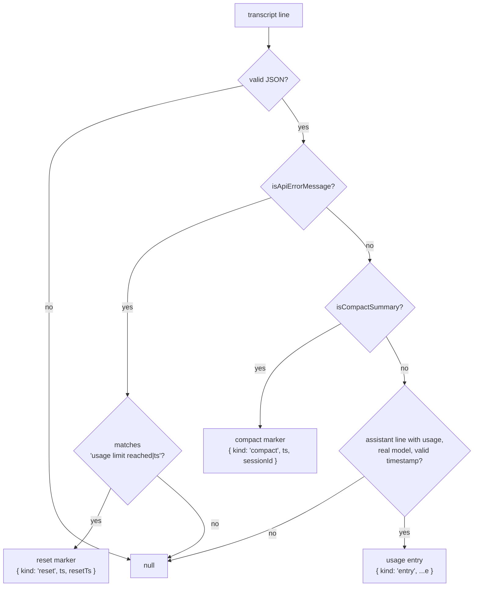
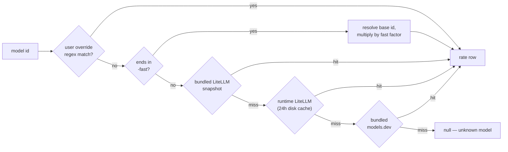

# ccmon — data contracts

This file is the single source of truth for ccmon's data contracts. Read
the relevant section before changing anything that crosses a module
boundary. TypeScript everywhere (strict): the contracts below exist as
types in `shared/types.ts` / `shared/ipc.ts`, and spec and types must stay
in sync. ESM syntax throughout; esbuild emits CJS for the Electron main
process (`dist-electron/`), Vite bundles the renderer.

Source files cite these sections by number (e.g. `docs/v2-spec.md §4`), so
the section numbering is stable. Don't renumber.

## 1. Entry contract (parser output)

`parseLine(raw, file, lineNo)` in `electron/services/parser.ts` returns one
of four things:



Skip rules (the `null` paths): non-assistant lines, no `message.usage`,
model missing or `'<synthetic>'`, unparseable timestamp. The reset marker's
`resetTs` is the captured unix seconds × 1000; API-error lines that don't
match the usage-limit pattern return null. Compact markers are collected by
the watcher (source-stamped on `watcher.compactions`, cleared on rescan)
and passed scope-filtered into `buildSnapshot` by main.

Entry `e`:

```js
{
  key,        // `${message.id}:${requestId}` | `m:${id}` | `f:${file}#${line}`
  msgId,      // message.id or null (for sidechain-aware dedupe)
  ts,         // epoch ms (Date.parse of line.timestamp)
  dateKey,    // 'YYYY-MM-DD' local time
  model,      // model id; '-fast' suffix appended when usage.speed === 'fast'
  fast,       // bool, usage.speed === 'fast'
  project,    // line.cwd, else lossy-decoded dir name
  sessionId,  // line.sessionId, else path-derived
  sidechain,  // bool
  in, out,    // input_tokens, output_tokens
  read,       // cache_read_input_tokens
  w5m, w1h,   // cache_creation split: prefer usage.cache_creation
              //   {ephemeral_5m_input_tokens, ephemeral_1h_input_tokens};
              //   if the object is absent, w5m = cache_creation_input_tokens.
              //   If the object exists but w5m+w1h < cache_creation_input_tokens,
              //   bill the remainder as w5m.
  costUSD,    // number from the line, or null (NOT computed here — cost is
              //   resolved at aggregate time so cost-mode/pricing changes
              //   apply without rescanning)
  tools,      // tool_use block names from message.content, in order (may
              //   repeat — one element per invocation); omitted when none
  stop,       // message.stop_reason ('tool_use'|'end_turn'|'max_tokens'|…)
              //   or null
}
```

Dedupe lives in the watcher and is best-wins, ccusage parity: duplicate
`key`s (streaming chunks carry cumulative usage) and msgId-only matches
across a sidechain boundary (subagent usage mirrored into parent
transcripts) merge into the stored entry, keeping the non-sidechain copy,
else the larger token total, else the fast-flagged copy. The merge also
upgrades `tools`/`stop` from the later cumulative chunk, never downgrading
a known value to null. See `watcher.accept` / `watcher.merge`; verify
changes with `npm run parity`.

## 2. Pricing engine contract — `electron/services/pricing.ts`

```js
const engine = await createPricingEngine({
  cacheDir,            // userData dir for the fetched-pricing disk cache
  offline = false,     // never touch the network
  overrides = {},      // ~/.config/ccmon/config.json "pricing" (regex → row)
  archive = null,      // PricingArchive — enables rates-of-the-day costing
});
engine.rates(model)        // → resolved rate row or null (memoized)
engine.cost(model, {in, out, read, w5m, w1h})  // → USD or null if unknown
engine.costAt(model, tokens, dateKey)  // → USD at the rates of that day when
                           //   the archive covers it; overrides still win,
                           //   layer misses + pre-archive dates fall back to
                           //   cost()'s current-rates resolution
engine.contextLimit(model) // → max_input_tokens or 200000 fallback
engine.meta()              // → { source: 'litellm-live'|'litellm-cache'|'bundled',
                           //     fetchedAt: ms|null, modelCount, lastError }
engine.refresh()           // → re-fetch from network (ignores offline), resolves meta
engine.unknown()           // → string[] of models that resolved null since creation
```

### Resolution order



The layered sources (later layers consulted only on miss, ccusage parity):

1. **Bundled LiteLLM snapshot** `electron/services/data/litellm-claude.json`
   (committed; per-TOKEN USD costs, fields: `input_cost_per_token`,
   `output_cost_per_token`, `cache_creation_input_token_cost`,
   `cache_read_input_token_cost`, `*_above_200k_tokens` ×4,
   `max_input_tokens`, `provider_specific_entry.fast`).
2. **Runtime LiteLLM refresh** (skipped when offline):
   `https://raw.githubusercontent.com/BerriAI/litellm/main/model_prices_and_context_window.json`
   via global `fetch` with a 10 s AbortController timeout; keep only keys
   starting `claude-` / `anthropic.` / `anthropic/`; persist compacted JSON
   plus `fetchedAt` to `<cacheDir>/pricing-cache.json`. On startup use the
   cache if under 24 h old, else refresh in the background (never block
   scanning). Failures keep the previous layer silently.
3. **Bundled models.dev snapshot**
   `electron/services/data/modelsdev-anthropic.json` (committed; per-MTOK
   costs ÷ 1e6 on load: `{cost: {input, output, cache_read, cache_write},
   limit: {context}}`).
4. **User overrides** (regex pattern keys, case-insensitive, per-MTok
   values: `{in, out, w5m, w1h, read}`) — always win.

### Resolution rules

- Key lookup per layer: exact, else strip a trailing `-YYYYMMDD` (8-digit)
  date suffix and retry, else strip a trailing `[...]` bracket suffix and
  retry both forms.
- Missing cache fields default: `cache_create = input × 1.25`,
  `cache_read = input × 0.1`.
- Cost formula per entry:
  `in×input + out×output + read×cache_read + w5m×cache_create + w1h×(input×2)`.
  1h cache writes price at 2× input (ccusage
  `CACHE_CREATE_1H_INPUT_MULTIPLIER`) unless an explicit per-model override
  provides `w1h`.
- Tiered >200k rates: when the entry's `in + read + w5m + w1h > 200_000`
  and `*_above_200k_tokens` fields exist, the WHOLE entry prices at the
  above-200k rates (ccusage threshold = 200_000).
- Fast entries (model ends in `-fast`): resolve the base model and multiply
  the final cost by `provider_specific_entry.fast`, else 2.0.
- `engine.cost` returns null only when no layer knows the model.

### Historical pricing — `electron/services/pricing-archive.ts`

Every successful LiteLLM refresh records the compacted catalog as a
`{since: 'YYYY-MM-DD', models}` layer in `<userData>/pricing-archive.json`,
appended only when the table actually differs from the newest layer, so the
file grows only on real price changes. `engine.costAt` resolves against the
newest layer with `since ≤ entry.dateKey` (per-layer memoized). The archive
builds FORWARD from the first run: dates before the first layer cost at
current rates, because the past can't be fetched retroactively.

### Cost modes

`costForMode(entry, mode, engine)`:

| mode | result |
|---|---|
| `auto` | `entry.costUSD ?? engine.costAt(model, entry, entry.dateKey) ?? 0` |
| `calculate` | `engine.costAt(...) ?? 0` |
| `display` | `entry.costUSD ?? 0` |

`scripts/update-pricing-snapshots.ts` refetches both catalog URLs,
recompacts with the same field/prefix rules, and rewrites the two committed
data files. Pure Node.

## 3. Blocks contract — `electron/services/blocks.ts`

ccusage-parity 5-hour billing windows, all UTC-epoch math.

- A block opens at `floorHour(ts) = Math.floor(ts / 3_600_000) * 3_600_000`
  and spans exactly 5 h.
- A new block starts when `ts - block.start > 5h` OR `ts - lastEntryTs > 5h`
  (both strict >). In the second case, insert a **gap block**
  `{ isGap: true, start: lastEntryTs + 5h, end: nextEntryTs }`.
- Active: `now - lastEntryTs < 5h && now < block.end` (strict <). Gap
  blocks are never active.
- `totalTokens = in + out + read + write` — cache INCLUDED, and this applies
  to block totals, burn rate, and limits alike.
- Burn (active block, ≥2 entries, over `lastTs - firstTs` minutes):
  `tokensPerMin = totalTokens / mins`,
  `tokensPerMinIndicator = (in + out) / mins`
  (level: `<2000 'normal'`, `<5000 'moderate'`, else `'high'`),
  `costPerHour = cost / mins × 60`.
- Projection (active block):
  `remainingMinutes = Math.round((end - now) / 60000)`,
  `totalTokens = Math.round(current + tokensPerMin × remainingMinutes)`,
  `totalCost = round2(cost + (costPerHour / 60) × remainingMinutes)`.
- Token limit: setting `'max'` → max `totalTokens` over COMPLETED (non-gap,
  non-active) blocks; numeric → as-is. Status vs the projection:
  `'exceeds'` > 100%, `'warning'` > 80%, else `'ok'`.

`computeBlocks(entries, { now, tokenLimit, costOf })` →
`{ active, blocks, count, maxBlockTokens }` where `blocks` is the last
30 days including gaps, ascending, each row per the §4 `blocks[]` shape.

## 4. Snapshot v2 contract (aggregate output)

`buildSnapshot(entries, { now, sourceDirs, version, pricing, settings,
resetTs, compactions })` in `electron/services/aggregate.ts`. Per-entry cost
is `costForMode(entry, settings.costMode, pricing)`, resolved exactly once
per entry (a memo shared with blocks and the feed). One full pass plus
small post-passes; ~200 ms at 45k entries, debounced upstream.

```js
{
  generatedAt, version, sourceDirs, entryCount, costMode,
  unknownModels: [],            // from pricing.unknown()
  totals: { cost, in, out, read, write, tokens /* in+out */,
            allTokens /* +cache */, entries, sessions, firstTs, lastTs },
  today: <day>,                 // days[last]
  week: { cost, tokens },       // rolling last-7-days incl today
  days: [ <day> × 35 ],         // continuous, zero-filled
  weekly: [ { week /* 'YYYY-MM-DD' bucket start */, cost, in, out, read,
              write, tokens, entries, days } × ≤12 ],   // per settings.startOfWeek
  monthly: [ { month /* 'YYYY-MM' */, cost, in, out, read, write, tokens,
               entries, days } × ≤12 ],
  hourly,                       // 7×24 (in+out), Monday-first
  hourlyCost,                   // 7×24 est cost, same orientation
  models: [ { model, cost, in, out, read, write, entries, sessions,
              firstTs, lastTs } ],                       // cost desc
  projects: [ { path, cost, todayCost, weekCost, in, out, read, write,
                tokens, entries, sessions, lastTs, sidechainCost,
                daily: [{date, cost} × 14] } × ≤40 ],    // lastTs desc
  sessions: [ { id, project, firstTs, lastTs, durationMs, cost, in, out,
                read, write, tokens, entries, models: [ids], compactions,
                context: { tokens, limit, pct } | null } × ≤150 ],
                // lastTs desc; context only for sessions active in the last
                // 48h: last entry's in+read+w5m+w1h vs
                // pricing.contextLimit(lastModel)
  block: {                      // active block or null
    start, end, entries, cost, in, out, read, write, totalTokens,
    models: [ids], firstTs, lastTs, remainingMs,
    burn: { tokensPerMin, tokensPerMinIndicator, costPerHour, level } | null,
    projection: { totalTokens, totalCost, remainingMinutes } | null,
    limit: { value, source: 'max'|'custom', currentPct, projectedPct,
             status: 'ok'|'warning'|'exceeds' } | null,
    usageLimitResetTs: ms | null,   // from resetTs when in the future
  } | null,
  blocks: [ { id, start, end, actualEnd, isActive, isGap, entries, cost,
              in, out, read, write, totalTokens, models,
              burn: {...}|null } ],   // last 30 days incl gaps, ascending
  cache: { readTokens, writeTokens, hitRate /* read/(read+in) */,
           savedUSD /* Σ read × (input_rate − read_rate) */,
           wouldHaveCostUSD /* totals.cost + savedUSD */,
           idle: { events, tokens, extraUSD } },   // §4.1
  whatIf: [ { model, totalCost, delta /* totalCost − totals.cost */,
              daily: [×35] /* per-day re-priced cost, aligned to days[] */
            } × ≤6 ],                              // §4.2
  sidechain: { cost, entries },                    // §4.3
  toolUse: { rows: [ { name, invocations, entries, cost } × ≤20 ],
             daily: [ { name, days: [×35] } × ≤8 ],
             turns, invocations },                 // §4.4
  stopReasons: { [stop_reason]: count },  // max_tokens = truncations
  compactions: number,  // total compact markers in scope; per-session
                        // counts live on sessions[].compactions
  records: { maxDay: {date, cost} | null,
             maxBlockTokens: number,
             longestSession: {id, project, durationMs} | null,
             activeDays, totalDays /* span first→last */,
             streak: {current, longest} /* consecutive active days */,
             avgDailyCost /* over active days */ },
  recentEvents: [ <feedEvent> × 15 ],
}
```

`<day>` = `{ date, cost, in, out, read, write, tokens, allTokens, entries,
sessions, models: [{model, cost, in, out, read, write, entries}] }`
(models sorted cost desc — powers stacked-by-model charts).

`<feedEvent>` = entry essentials + `ctx` (the entry's
`in + read + w5m + w1h` context footprint).

### 4.1 `cache.idle` — the cost of walking away

Within a session, an entry arriving after an idle gap longer than a cache
tier's TTL (5m tier: gap > 5 min; 1h tier: gap > 60 min since the session's
previous entry) re-writes cache the session already paid for. Such an entry
counts as one of `events`, its gap-expired `w5m`/`w1h` tokens add to
`tokens`, and `extraUSD` adds `tokens × (write_rate − read_rate)`, the
marginal cost vs returning before expiry (1h tier write rate: explicit
override else `input × 2`). Heuristic by design: prompt edits also
invalidate caches, so gap-correlated writes are attributed to idling. A
session's first entry never counts; unknown-model entries contribute
tokens/events but $0.

### 4.2 `whatIf` — counterfactual re-pricing

EVERY entry re-priced onto each of the top-6 models (by cost) with its
exact token splits and tier rules. Entry-exact, not an average: candidate
rate rows resolve once, then the per-entry loop is pure arithmetic
(`costWith`). Sorted totalCost ascending; candidates the engine can't price
are skipped.

### 4.3 `sidechain` — subagent spend floor

Spend on entries that survive dedupe still flagged sidechain. Mirrored
subagent usage dedupes to the parent's NON-sidechain copy, so this counts
only sidechain-exclusive entries: a floor on true subagent spend, not the
ceiling.

### 4.4 `toolUse` — tool attribution

`rows` sorted invocations desc. Per-tool `cost` is the estimated cost of
the TURNS where the tool appears; a turn invoking several tools counts
fully toward each, so rows overlap. It answers "where do tokens go", not an
exact split. Raw tool names are kept verbatim (`mcp__server__tool`).
`daily` aligns to `days[]` and holds the top ≤8 tools by in-window count.

## 5. Settings, accounts, limits, currency

### 5.1 Settings

```js
{ theme: 'nord', costMode: 'auto'|'calculate'|'display',
  pricingOffline: false,
  startOfWeek: 'monday',  // forced — the sunday option is retired; the type
                          // keeps the union for old settings files, which
                          // are normalized to monday on load
  tokenLimit: 'max' | <number> | null, compactNumbers: true,
  currency: 'USD',        // display currency code — see §5.4
  sources: null | [<project-dir path>] }
```

`sources` scopes analytics to a subset of detected data roots
(multi-account setups). `null` (no saved choice) means the PRIMARY account
only: the literal `~/.claude` root when present, else the first detected;
extra roots are opt-in. An array selects exactly those dirs; selecting
every dir means all. Entries carry a `source` tag (their owning root, added
by the watcher); main filters entries by scope before `buildSnapshot` and
before emitting feed events, so switching scope never rescans. Stale paths
in `sources` are ignored; an all-stale selection falls back to the default.

The renderer patches via `window.ccmon.setSettings(partial)`; main echoes
`settings:changed` and recomputes the snapshot when costMode / startOfWeek /
tokenLimit / sources change. `window.ccmon.refreshPricing()` forces a
pricing refetch; `pricing:meta` events carry `engine.meta()`.

`accountWrapperPrefs: Record<config-root, { name?, disabled? }>` holds
per-account overrides for the generated shell wrapper (`claude-*` commands,
§8): `name` overrides the wrapper command; `disabled: true` untracks the
account — it's dropped from the next generated
`~/.config/ccmon/claude-accounts.sh`, but the config root, its transcripts,
and its credentials are never touched. Absent/empty means every detected
root gets its auto-suggested name (`~/.claude` → `claude-personal`, else
`claude-<suffix>`). `AccountsView`'s per-account rename/remove controls and
`SetupWizard` both read and write this map via `effectiveWrapperAccounts()`
(`src/lib/crossAccount.ts`) so the wizard and the quick-action buttons never
disagree on what the wrapper file should contain.

For every account EXCEPT the default `~/.claude` root, `name` is never set
independently of the folder — `AccountsView`'s single "rename" control (§8)
always renames the config-root folder AND sets `name` to
`claude-<newSuffix>` in the same action, so the wrapper command and the
folder suffix can never drift apart (a real bug from the two-control design
this replaced: a user's own hand-maintained shell rc could fall out of sync
with a renamed folder with no indication anything was wrong). The default
root has no folder to rename, so it's the one place `name` is still a
free-text label. Untracking (`disabled`) and re-adding are unaffected by
this and still call `updateWrapperAccounts(accounts)` directly, which only
rewrites the managed wrapper file (`writeWrapperAccounts` in
`account-setup.ts`) — never rc files, so no shell selection is needed. This
map is keyed by absolute config-root path, so a folder rename (§8,
`renameAccountDir`) migrates the entry to the new root key itself — the map
has no path-rename awareness of its own.

### 5.2 Accounts and live limits — `electron/services/accounts.ts`

Each source root's identity (plan / tier / email / org) is read from
`<root>/.claude.json` (or the sibling `~/.claude.json` for the default
root) plus `<root>/.credentials.json`'s `rateLimitTier`
(`default_claude_max_5x` → tier `'5x'`, distinguishing Max 5x from Max 20x;
the same value exists server-side at `/api/oauth/profile`
`organization.rate_limit_tier`). Exposed as `accounts` (dir-keyed) in
`app:getState`.

`AccountInfo.cleanupPeriodDays` reads `<root>/settings.json`'s
`cleanupPeriodDays` (Claude Code's own transcript-retention window — it
deletes session transcripts older than this, at CLI startup) via
`cleanupPeriodDays()` in `accounts.ts`, falling back to Claude Code's
default of 30 when the file is missing or the value is invalid (< 1 or
non-numeric — the CLI itself rejects those). This is why "all time" totals
(`OverviewView.tsx`'s summary card) can't cover more history than that
window: ccmon has no data beyond whatever transcripts are still on disk.
The overview Hint names the actual configured window(s) for the accounts in
scope rather than assuming the default.

Main ALWAYS polls Anthropic's OAuth usage endpoint (the same one Claude
Code's `/usage` screen calls) every 60 s for EVERY discovered account —
independent of the data scope, since the account about to cap may not be the
one whose usage is on screen (this powers the accounts dashboard and
cross-account headroom). The overview's `<PlanLimits/>` then scope-filters
`limits` to the viewed account(s) via `useScopedDirs()`, so its behavior is
unchanged. Polling uses `<root>/.credentials.json` read-only. The poller
NEVER refreshes tokens (refresh-token rotation could invalidate the user's
Claude Code login); an expired login reports an error string instead, and the
UI offers a "Log in" control. Accounts with no stored login are omitted. A
shape guard fails loudly if the endpoint answers 200 with no recognizable
windows (it is undocumented and may change).

Re-login (`auth.ts`) is the ONLY place ccmon writes credentials and runs
solely from that explicit user action. A click first tries the refresh-token
grant against `https://console.anthropic.com/v1/oauth/token` (public Claude
Code client `9d1c250a-…`); a dead refresh token falls back to a browser PKCE
flow (authorize on `claude.ai/oauth/authorize` with `code=true`, the user
pastes the returned `code#state`). Both grants persist the rotated pair back
to `.credentials.json` atomically (temp + rename, mode 0600), reusing the
account's existing scopes so a re-login never downgrades them — which is what
keeps ccmon and Claude Code in lockstep. Exposed as `login(dir)` /
`submitLoginCode(dir, code)` on `CcmonApi`.

Results per dir, `{ok, fetchedAt, session, week, weekOpus, weekSonnet}`
with windows as `{pct, resetsAt}` (from `five_hour` / `seven_day` /
`seven_day_opus` / `seven_day_sonnet`), flow via `limits:data` events and
`limits` in getState. The `<PlanLimits/>` panel renders the scoped
account(s) on the overview view only (the Blocks view used to duplicate it;
now it just reads `haveLiveLimits` off the same `limits` map to decide
whether to hide its own local block-derived estimate); the accounts
dashboard (`src/views/AccountsView.tsx`) renders ALL of them. `bindingSession`/
`bindingWeek` in `src/lib/limits.ts` take an optional `dirs` allow-list so a
caller can bind across the scoped accounts (overview) or all of them.

Failures are VERBOSE and graceful: a failed refresh keeps the last good
result (flagged `stale: true` with `lastError` + `nextRetryAt`) instead of
dropping to an error; first-ever failures carry `{ok: false, error, status,
nextRetryAt}` with a human-readable reason. Failing dirs retry on a FIXED
60 s cadence, no exponential growth; only a server `Retry-After` longer
than that extends a wait. Manual refresh fires immediately and never
escalates the schedule. Scope changes no longer trigger a limits refresh —
the poll is account-wide, so scope only re-buckets the snapshot.

### 5.3 Limits history and forecast — `electron/services/limits-history.ts`

Pure Node. Main records every successful NON-stale poll as a
`{ts, session, week, weekOpus}` utilization-pct sample per dir, persisted
to `<userData>/limits-history.json`: raw for the last 2 h, thinned to one
sample per 15 min beyond that, capped at 7 days.

Each ok `LimitsResult` then carries:

- `history` — ≤120 ascending points for sparklines.
- `forecast: {session, week}` — each window a `{etaTs, pctPerHour}` from a
  least-squares fit over the trailing samples (session: 60 min lookback,
  ≥10 min span; week: 6 h lookback, ≥30 min span; both ≥3 samples), cut at
  the most recent utilization drop > 5 pts (a window reset — utilization
  only climbs between resets). `etaTs` is when the fit reaches 100%
  (clamped to now), null when the pace is ≤0.05 pct/h. The UI shows
  "caps ~thu 15:04 at this pace" only when `etaTs` lands before the
  window's `resetsAt`, else just the pace.
- `caps` — a retrospective per window over the retained history:
  `{resets, capped}`, where a reset is a drop > 5 pts between consecutive
  samples and counts as capped when the pre-drop utilization was ≥95%.

Failed refreshes re-serve the last good history/forecast/caps unchanged,
under the same `stale` flag.

Samples are keyed by project dir, so a folder rename (§8,
`renameAccountDir`) would otherwise orphan them under the old key —
`renameDir(oldDir, newDir)` moves (merging + re-sorting by `ts` if the new
key somehow already has samples) and deletes the old entry; the
`setup:renameAccount` handler calls it right after a successful rename.

### 5.4 Display currency — `electron/services/currency.ts`

Everything internal stays USD: snapshot, pricing, settings thresholds. Main
refreshes on startup and every 1 h (plus `window.ccmon.refreshCurrency()`
for the manual button), fetching TWO legs in parallel with 10 s timeouts:

- all-world fiat from `https://open.er-api.com/v6/latest/USD` (~160 codes)
- top-10 crypto from CoinGecko `simple/price` (`CRYPTO_CURRENCIES` in
  `shared/types.ts`: BTC ETH USDT XRP BNB SOL USDC DOGE ADA TRX;
  rate = 1 ÷ usd price)

Legs merge over the previous table so a failed leg keeps serving its last
rates; `lastError` names the failed leg(s) and is null only when both
succeeded. Persisted to `<userData>/currency-cache.json`; emitted as
`CurrencyRates` via `currency:data` and `currency` in getState.

Conversion happens at FORMAT time in the renderer:
`configureCurrency(code, rate)` in `src/lib/format.ts` retargets
`fmtUSD` / `fmtUSDPrecise` / `axisUSD` / `currencySymbol`; bootstrap calls
it when `settings.currency` or the rates change and re-emits the snapshot
and feed (cloned) so every subscriber re-renders. Crypto codes bypass Intl
currency style (4-letter codes are invalid there) and format with 5
significant digits plus a symbol/code prefix. Unknown or missing rates fall
back to USD silently.

### 5.5 Live data is authoritative

When any scoped account has an ok limits result, the renderer hides the
token-based local limit gauge (`block.limit`); the local estimate renders
only as an offline / no-credentials fallback. The active-block hero and the
overview block card also use the binding live session window
(`resetsAt − 5h → resetsAt`, see `src/lib/limits.ts`) instead of the
floor-hour block bounds, which can run up to 59 min early. The snapshot
carries top-level `usageLimitResetTs` (ms | null) so the UI can show the
local "limit reached, resets at" marker even when there is no active block.

### 5.6 Cross-account resume — `electron/services/cross-account.ts`, `src/lib/crossAccount.ts`

Two read-only halves. `recentSessions(<root>/projects, limit)` (pure Node)
walks the transcripts recursively (depth-capped; subagent transcripts nest),
reads each file's first `cwd` from a 64 KB head, dedupes by session id
(newest wins) and returns `RecentSession {id, cwd, project, mtime}` newest
first. Exposed read-only via `listRecentSessions` (the `sessions:recent` IPC
guards that the dir is a known source root — never an arbitrary path).

`crossAccountAdvice(accounts, limits)` (renderer, pure) compares every
account's session and weekly windows and returns advice only when the
binding account is ≥80 % utilized AND another account with a stored login is
≥25 pts lower AND itself below 70 % — i.e. genuinely worth switching to.
`crossResumeCommand(fromDir, toDir, id?)` emits the canonical
`claude-cross-resume <fromRoot> <toRoot> <id>` (roots via `accountRoot()`,
shell-quoted). ccmon NEVER copies or launches a session — it surfaces the
command for the user to run their own wrapper.

## 6. Renderer conventions

- One store: `src/store/useUsageStore.ts`. Subscribe with selectors
  (`useUsageStore((s) => s.snapshot)` etc.); patch settings via
  `updateSettings(partial)` from `src/bootstrap.ts`.
- Reuse `src/lib/format.ts` (`fmtUSD`, `fmtUSDPrecise`, `fmtTok`, `fmtInt`,
  `shortModel`, `relTime`, `countdown`, `clockTime`, `dayLabel`,
  `projectName`, `tildify`, `axisUSD`, `currencySymbol`) and
  `src/lib/palette.ts` (`ACCENTS`, `TOKEN_COLORS`, `withAlpha`). View-local
  helpers stay inside their own files.
- Layout primitives: `<Panel title right>`, grid classes `g3 g4 g5 g7 g8
  g12` (g6 via inline span) inside `<div className="grid">`, `useNow(ms)`
  for ticking time.
- Styling: CSS classes only, colors ONLY via theme tokens
  (`--bg0..2, --line, --line-soft, --text, --text-dim, --text-faint,
  --sage, --amber, --rose, --blue, --chart-1..6, --ok, --warn, --bad`),
  alpha via `color-mix(in srgb, var(--x) N%, transparent)`. Each view owns
  a co-located css file with view-prefixed classes (`.act-`, `.ins-`,
  `.spa-`, …). Do NOT edit `global.css` from a view change.
- Charts: recharts with `isAnimationActive={false}`, axis ticks
  `{ fill: 'var(--text-faint)', fontSize: 10, fontFamily: 'JetBrains Mono' }`,
  tooltips as custom `.chart-tip` content. `DailyChart.tsx` is the house
  style.
- Aesthetic: lowercase mono labels, muted colors, no emoji in UI chrome,
  generous whitespace, subtle hover states. Professional lofi.
- Methodology notes: never inline long explanatory prose in a panel.
  Collapse it behind `<Hint label="why?">` (`src/components/ui/Hint.tsx`).
- Month-end projection (InsightsView, renderer-only): weekday-adjusted —
  current month spend plus the 35-day weekday-average profile for each
  remaining calendar day, with a ±1σ band (std of daily residuals vs the
  profile × √remaining days; the low end floors at spent-so-far). Spike
  days: daily cost above `median + 3.5 × 1.4826 × MAD` of the window's
  nonzero days (needs ≥5 active days and MAD > 0, else no flags).
- Plan value (InsightsView, renderer-only, no snapshot field): the current
  month's API-equivalent cost (current `monthly` row, current costMode) vs
  the scoped accounts' subscription prices via `planPriceUSD()` in
  `src/lib/plans.ts` (shared with the accounts dashboard; table in
  `shared/plans.ts`: pro $20,
  max 5x $100, max 20x $200; the single place to update; max with unknown
  tier assumes 5x). Team/enterprise are excluded (seat pricing unknown →
  no-plan placeholder). Scope resolution mirrors main's `sourceScope()` via
  `scopedDirs()` in `src/lib/limits.ts`; prices sum across scoped accounts.

## 7. Module boundaries

Keep changes scoped to one area per PR where possible:

| Area | Files | Validate with |
|---|---|---|
| pricing | `electron/services/pricing.ts`, `pricing-archive.ts`, `scripts/update-pricing-snapshots.ts` | `npm test` + `npm run smoke` |
| analytics | `electron/services/parser.ts`, `blocks.ts`, `aggregate.ts` | `npm test` + `npm run smoke`; `npm run parity` when parsing/dedupe changes |
| themes | `src/theme/themes.ts` | `npm run typecheck` (the `Theme` type enforces every token) |
| views | one `src/views/<X>View.tsx` + its co-located css | `npm run typecheck` |
| accounts | `electron/services/accounts.ts`, `cross-account.ts`, `account-setup.ts`, `src/lib/crossAccount.ts`, `src/views/AccountsView.tsx`, `src/components/accounts/` | `npm test` + `npm run smoke` |
| wiring | `main.ts`, `preload.ts`, `watcher.ts`, store, bootstrap, `shared/` | all of the above |

Cross-boundary changes (snapshot fields, IPC, settings) start in this spec
and `shared/types.ts`, then fan out.

## 8. Multi-account setup wizard — `electron/services/account-setup.ts`

Pure Node, fully unit-tested, NEVER imports Electron. Turns the manual
multi-account flow into a guided, idempotent, preview-first action that
writes shell startup files. Design rule: **never edit an rc file in place**
(except the opt-in tidy, below). **OS-aware**: a `family` (`posix` |
`powershell`) is derived from `process.platform` and threaded through
generation, detection, and linking — one family per run.

- `resolveLoginShell()` trusts `/etc/passwd` (via `getent passwd $USER`)
  over `$SHELL` — `$SHELL` lies in wrapped/nested shells (reads `zsh` while
  the login shell is `zy`). Falls back to `$SHELL` only when `getent` is
  absent (macOS). On Windows `resolvePowershellProfile()` asks
  `pwsh`/`powershell` for `$PROFILE`, falling back to the PS7 default path.
- `detectShells(env)` returns `{platform, shells}`. On Linux/macOS the
  candidates are zy/zsh/bash (bash → `~/.bash_profile` on macOS, the file
  login shells read there), but a shell is shown ONLY when it's the login
  shell OR its rc already exists — an unconfigured shell the user doesn't run
  (e.g. zsh with no `~/.zshrc`) is hidden rather than offered for creation.
  The login shell is flagged `detected`. On Windows it's a single PowerShell
  `$PROFILE` target. Injectable `env {home, loginShell, platform, psProfile}`
  for tests, so every OS path is unit-tested on one host.
- `renderManagedScript(accounts, home, family)` builds the contents of the
  ONE ccmon-owned file — `~/.config/ccmon/claude-accounts.{sh,ps1}`. POSIX:
  a `claude-<name>() { ( export CLAUDE_CONFIG_DIR=…; claude "$@" ); }`
  launcher (`$HOME`-relative) per account plus a `claude-<to>-from-<from>`
  resume helper per ordered pair. PowerShell: a
  `function claude-<name> { $env:CLAUDE_CONFIG_DIR = …; claude @args }`
  launcher per account (no `-from-` helpers — the bash cross-resume helper is
  Unix-only). Regenerated wholesale on every apply.
- `applySetup(opts)` (re)writes that file, then appends a single guarded
  block (`# >>> ccmon managed >>>` … `. claude-accounts.sh` … `# <<< … <<<`)
  to each chosen rc that lacks it, and optionally installs the embedded
  `claude-cross-resume` helper to `~/.local/bin` (mode 0755). The helper's
  overwrite policy makes the personal↔work round-trip lossless: it copies the
  transcript when the destination is missing or the source has more lines (a
  resumed session only appends, so more lines == newer), backing any
  overwritten destination up to a timestamped `*.bak` first; `--force`/`--keep`
  override the heuristic, `--dry-run`/`--no-launch` stop short of resuming.
  Idempotent: a
  second apply links nothing new and never duplicates the block; by default
  rc files are only ever appended to, never rewritten. `planSetup(opts)` is
  the dry run — exact contents + per-rc append/no-op + helper status +
  validation `problems` — and the UI requires it before `apply` is enabled,
  so the user always sees the diff before any write.
- **Conflict handling.** `scanRcForWrappers` finds pre-existing hand-written
  definitions of any managed name (launchers + resume helpers, via the shared
  `managedNames`/`crossPairs`) OUTSIDE ccmon's block. `planSetup` reports them
  per-rc (`existing`) plus a non-blocking `warning`: identical managed copies
  would merely shadow them (last-wins). Opt-in `tidyExisting` comments out the
  single-line ones with a reversible `# ccmon superseded → ` prefix
  (multi-line defs are flagged for manual removal, never auto-edited). Tidy is
  the ONLY path that rewrites an rc, and it does so atomically (temp +
  rename); it's idempotent (already-commented lines are skipped).
- `createAccountDir(suffix)` makes `~/.claude-<suffix>/projects` (validated
  suffix) so a new account shows up; live file-watching of it still needs an
  app relaunch.
- `renameAccountDir(root, suffix)` moves `~/.claude-<old>` →
  `~/.claude-<suffix>` on disk with `fs.renameSync`. Refuses the literal
  `~/.claude` root unconditionally — Claude Code's CLI, and anything else
  that doesn't go through a ccmon wrapper, falls back to that exact path
  when `CLAUDE_CONFIG_DIR` is unset, so moving it would break tools outside
  ccmon's control (`isDefaultAccountRoot` in `src/lib/crossAccount.ts` gates
  the UI control for the same reason). Rejects a collision with an existing
  dir. The Accounts view's single "rename" control (every account except the
  default root) calls this AND sets `accountWrapperPrefs[newRoot].name` to
  `claude-<suffix>` in the same confirmed action (§5.1) — the folder and the
  wrapper command always rename together, never independently, then
  re-detects `sourceDirs`/`accounts` the same way `createAccount` does —
  live file-watching of the new path still needs an app relaunch, so the UI
  says so after a successful rename. The `setup:renameAccount` IPC handler
  (main.ts) ALSO migrates the two other places a pre-rename project-dir
  path can be pinned, so the renamed account doesn't quietly vanish or lose
  history after a restart: `LimitsHistory.renameDir()` (§5.3, moves the
  sparkline/forecast/caps samples to the new dir key) and, if the old dir
  was named in `settings.sources` (§5.1 — e.g. the account was individually
  scoped or included in "view all together"), that entry is rewritten to
  the new dir and `settings:changed` is re-broadcast. Without this, a saved
  scope naming the old path goes stale per §5.1's "stale paths are ignored"
  rule and the renamed account silently drops out of Overview/Insights
  while still showing correctly in the Accounts view (which lists every
  `sourceDirs` entry unscoped).
- `writeWrapperAccounts(accounts)` rewrites ONLY the managed script file —
  no rc edits, no helper install, no rc-selection requirement. Backs the
  Accounts view's combined rename (above), the default root's label-only
  rename (inline edit — the one case with no folder to move), and untrack
  ("remove from shell", confirmed via `ConfirmDialog`) controls, all of
  which persist to `settings.accountWrapperPrefs` (§5.1) and then call this
  so the wrapper file matches immediately, without going through the full
  wizard/rc flow. `SetupWizard` filters `disabled` roots out of the accounts
  it manages, so an untracked account isn't resurrected by a later full
  apply; re-adding it (no confirmation — non-destructive) is a plain toggle
  in the Accounts view.

IPC: `detectShells`, `previewSetup`, `applySetup`, `createAccount`,
`renameAccount`, `updateWrapperAccounts`. Within the POSIX family the wrapper body is
identical across bash/zsh/zy; only the target rc differs. PowerShell uses
its own syntax and skips the bash helper, so on Windows the dashboard's
cross-resume command needs WSL/Git Bash. The read-only features (accounts
dashboard, live limits, cross-account headroom) are platform-independent —
only this wizard is shell/OS-specific.
